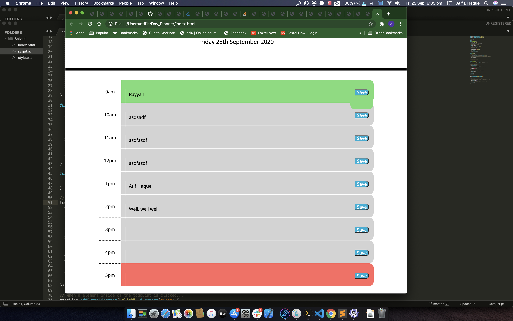
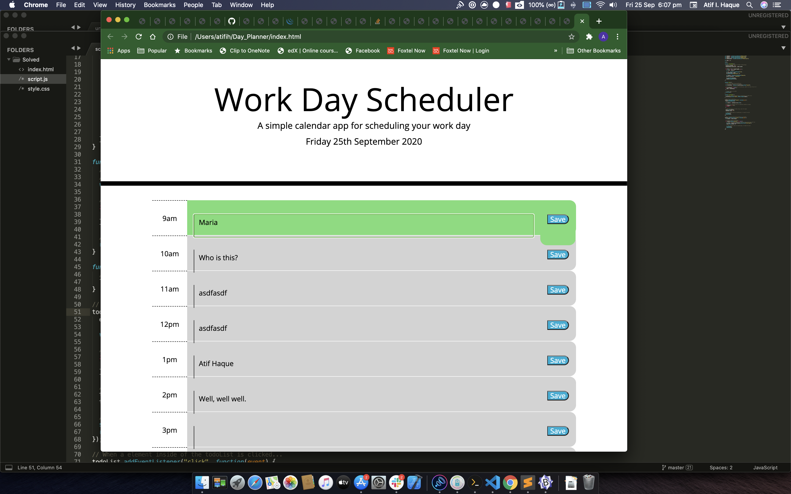

# Day_Planner
A calendar application that enables that enables the end-user to save events that correspond to each hour in the day. The app runs in the browser featuring dynamically updated HTML and CSS powered with jQuery.

# Contents
The app is composed of 3 files rendering a single web page. The files associated with  the web page are as follows:

1. index.html 
2. style.css 
3. jquery.js

 # User Story
An employee with a busy schedule wants to add important events to a daily planner in order to manage their time effectively.

# Built With. people.

Microsoft VScode - Code editor.
[Terminal] - command line user interface for the z-shell.Used the program that ships with Mac OS "Catalina".

# Screenshots

# Licence
MIT License.

# Link to the App
https://github.com/atifih/Day_Planner

# Authors
Haque, Atif

# Contact information
atif.haque@gmail.com

# Acknowledgments
My instructor and the TAs at the Bootcamp.
